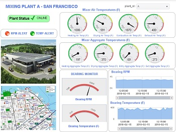

# RTView ClearBlade Project

## Overview
This project provides tools and examples that demonstrate how RTView Cloud can be used to display ClearBlade topics in graphical and highly configurable displays in the Cloud.
By following the steps, described below, you will be:
* Installing and running an RTView data server on your local computer.
* Installing and running a node script that subscribes to a few ClearBlade topics and pushes the data to the RTView data server.
* Viewing preexisting displays, populated by data, coming via a servlet within RTView, through your free trial account on RTViewCloud.

### Software Requirements
A computer with:
* Node.js Version 6.9.0 or newer
* A browser of your choice (e.g. Google Chrome 57.x+, MS IE 11.x+, MS Edge, or Mozilla Firefox 50.x+)
* RTViewDataServer-Mini package (a zip file, which will be available through SL Corporation)
* RTView-ClearBlade-Displays package (a directory, which is available through GitHub)
* RTView-ClearBlade-Node package (a directory, which is available through GitHub)
* A free trial subscription to RTViewCloud services

## Installation of the packages

On your computer:

* Create a directory and name it rtvdemos.
* Download the RTViewDataServer-Mini.zip (THE DOWNLOAD LOCATION HAS NOT BEEN DEFINED, YET!)
* Download the RTView-ClearBlade repository to your computer (i.e., RTView-ClearBlade-master.zip)

### Installation and execution of the RTViewDataServer-Mini package
Bring up a Command prompt.

*cd rtvdemos*

*copy \sourcePath\RTViewDataServer-Mini.zip*

	Where sourcePath is the location of your download

Unzip the RTViewDataServer-Mini.zip using your favorite zip/unzip utility.

	This will create a directory under rtvdemos by the same name (i.e., RTViewDataServer-Mini).

*cd RTViewDataServer-Mini*

*start_server*

	This will start the RTView data server which will work as the receiver and cache storage 
	for the incoming data.

*cd ..*

### Installation of the RTView-ClearBlade-Displays package

* Make sure you are in rtvdemos directory.
* Extract the RTView-ClearBlade-Displays directory out of the RTView-ClearBlade-master.zip into rtvdemos.

### Installation and execution of the RTView-ClearBlade-Node package

* Make sure you are in rtvdemos directory.
* Extract the RTView-ClearBlade-Node directory out of the RTView-ClearBlade-master.zip into rtvdemos.

*cd RTView-ClearBlade-Node*

*npm install*

	This will install the necessary node packages.

*node rtview_clearblade_feed*

	This will start the node script which subscribes to a few ClearBlade topics and pushes 
	the data into the RTView data server, which was set up in the previous section.

### Subscription, configuration and execution of the RTViewCloud Services

* In a browser, go to [RTViewCloud](http://rtviewcloud.sl.com/).

* Click on Start Free Trial and follow the process to get your free trial account.

* Log in to your RTViewCloud account.

	Notice that you are automatically in your own private organization (e.g. JohnSPrivateOrg).
	
### Connecting the displays to your local RTView data server

* On the top menu, click on Data.

	This will take you to the RTData Server List page in which you will create a connection 
	to your RTView data server.
	
* Click on the Add Server button.

* For Name, type:
CLEARBLADE-IOT-SERVER

* For Host/URL, type:
http://localhost:3270/rtvquery

* Click on Save Added Servers.

* To test the connection, click on the green magnifying glass next to the CLEARBLADE-IOT-SERVER.
	This will bring up the RTView DataServer - Cache Tables dialog.
	You should see "Connected" under Connection Status. 
	You should also see the ClearBladeCache in the CacheTable.
	
* Close the dialog.

* On the top menu, click on Design.

	This will bring up the RTDraw, which is RTViewCloud’s visual editor.
	
* Click on File in the menu.

* Click on Import ….

* In the file browser, change directory to \rtvdemos\RTView-ClearBlade-Displays.

* Select all displays and click Open.

	This step only needs to be done once for each display.

* Click on File in the menu.

* Click on Open ….

* Double click on cb_mixing_plants.

	This will load the cb_mixing_plants display into the editor. 
	This display is configured to connect to your local RTView data server and collect data. This process then populates the display with live data that is being collected by the node script from ClearBlade.

## Achieved Goals
RTView-ClearBlade demo should have : 
* Shown how easy it is to display ClearBlade topics in graphical and highly configurable displays in the Cloud.
* Conveyed the structure of the node script, needed to send data to RTView, which subscribes to topics of interest.
* Allowed the users to enhance the existing RTView displays or create new ones.

**_Feel free to experiment with this project, modify it, enhance it and share your experience, comments, suggestions and/or enhancements with us._**

